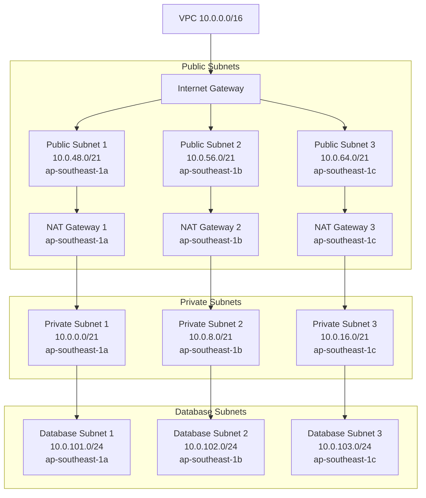

# Networking

```mermaid
flowchart TD
    A[VPC 10.0.0.0/16] --> B[Internet Gateway]

    subgraph Public Subnets
        B --> PS1[Public Subnet 1<br>10.0.48.0/21<br>ap-southeast-1a]
        B --> PS2[Public Subnet 2<br>10.0.56.0/21<br>ap-southeast-1b]
        B --> PS3[Public Subnet 3<br>10.0.64.0/21<br>ap-southeast-1c]
        
        PS1 --> NAT1[NAT Gateway 1<br>ap-southeast-1a]
        PS2 --> NAT2[NAT Gateway 2<br>ap-southeast-1b]
        PS3 --> NAT3[NAT Gateway 3<br>ap-southeast-1c]
    end

    subgraph Private Subnets
        NAT1 --> PR1[Private Subnet 1<br>10.0.0.0/21<br>ap-southeast-1a]
        NAT2 --> PR2[Private Subnet 2<br>10.0.8.0/21<br>ap-southeast-1b]
        NAT3 --> PR3[Private Subnet 3<br>10.0.16.0/21<br>ap-southeast-1c]
    end

    subgraph Database Subnets
        PR1 --> DB1[Database Subnet 1<br>10.0.101.0/24<br>ap-southeast-1a]
        PR2 --> DB2[Database Subnet 2<br>10.0.102.0/24<br>ap-southeast-1b]
        PR3 --> DB3[Database Subnet 3<br>10.0.103.0/24<br>ap-southeast-1c]
    end
```